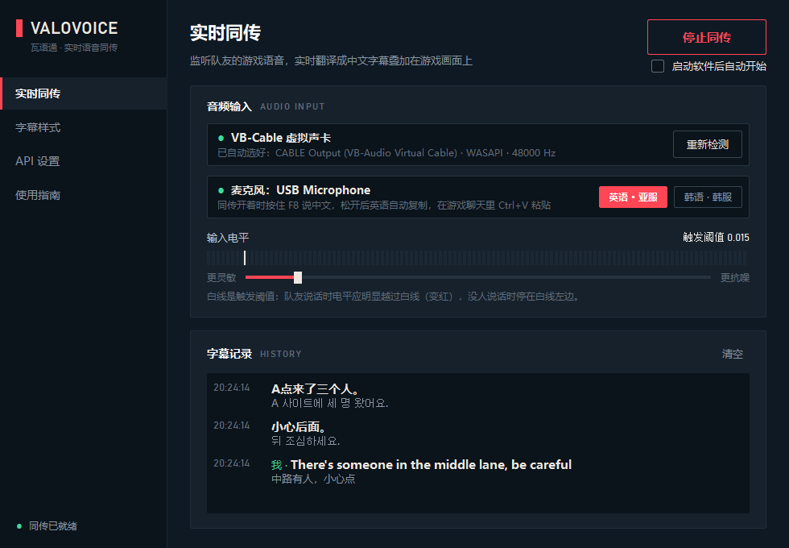

# 瓦语通 VALOVOICE · VALORANT 实时语音同传

把队友的语音（韩语、英语等）实时翻译成**中文双语字幕**，叠加在游戏画面上；**按住 F8 说中文**，自动翻译成英语或韩语并复制，回车后 Ctrl+V 就能发到游戏聊天。给在亚服、韩服打排位、外语不太好的中国玩家用。

> **English:** A real-time voice translation overlay for VALORANT. Teammates' voice chat (Korean, English and 70+ other languages, auto-detected) becomes bilingual Chinese subtitles on top of the game; hold F8 and speak Chinese to get English or Korean text in your clipboard for the in-game chat. Powered by Google Gemini 3.5 Live Translate. Windows only, Chinese UI.


## 功能

- **双语字幕**：上面一行原文（韩语 / 英语……），下面一行中文。最新一句在最上面，上一句变暗，到时自动消失
- **按住 F8 说中文 → 英语（亚服）/ 韩语（韩服）**：松开后约 2 秒译文自动复制到剪贴板
- **字幕框一直显示**，底部状态行告诉你软件是否在工作（同传已就绪 / 正在连接 / 未开始）
- **锁定后鼠标穿透**，不影响游戏操作；位置、字号、背景透明度、停留时间都能调
- **断线无缝重连**：Google 每条连接大约 10 分钟会断开一次，软件会提前切到新连接，字幕不丢
- 自动找到 VB-Cable 和你的麦克风，不用在一堆设备里挑



## 需要准备

- Windows 10 / 11，[Python 3.10+](https://www.python.org/downloads/)
- [VB-CABLE 虚拟声卡](https://vb-audio.com/Cable/)（免费）：用来单独收队友的语音，游戏枪声、音乐不会混进来
- Google Gemini API Key：在 [Google AI Studio](https://aistudio.google.com/apikey) 免费创建

## 安装和启动

```bash
git clone https://github.com/liuzhiyuan011215-cmyk/valorant-translator.git
cd valorant-translator
pip install -r requirements.txt
python main.py
```

想要桌面上双击就能打开、不弹黑色命令行窗口的图标：

```bash
python create_desktop_shortcut.py
```

## 第一次使用

1. **填 API Key**：软件「API 设置」页填入你的 Gemini API Key，点保存。Key 只保存在本机的 `config.json`，不会被上传（已写进 `.gitignore`）。
2. **装 VB-CABLE**：下载解压后右键「以管理员身份运行」`VBCABLE_Setup_x64.exe`，装完重启电脑。
3. **游戏里改语音输出**：设置 → 音频 → 语音聊天 → 输出设备改成 **CABLE Input (VB-Audio Virtual Cable)**，麦克风不用改。
4. **让自己也能听到队友**：Windows 声音设置 → 更多声音设置 → 录制 → CABLE Output → 属性 → 侦听，勾选「侦听此设备」，播放设备选你的耳机。
5. **显示模式改成无边框窗口化**：设置 → 画面 → 显示模式 → 无边框窗口化（Windowed Fullscreen），字幕才能显示在游戏上方。
6. **开始**：回到软件点「开始同传」。F8 打字语言：**亚服选英语，韩服选韩语**。在「字幕样式」页把字幕拖到顺手的位置后锁定。

软件里的「使用指南」页也有同样的步骤。

## 使用说明

- 队友说话时，字幕框里先出原文，中文译文紧跟着补在下面
- 打字聊天：按住 **F8** 说中文 → 松开 → 等状态行显示「已复制」→ 回车打开聊天 → **Ctrl+V** → 回车发送。粘贴前可以看一眼绿条那条，上面是识别到的中文，下面是要发的译文
- 直接用英语 / 韩语说也行，会原样转写成文字复制
- 启动软件后自动开始同传（主界面开始按钮下面可以关掉）

## 注意

- 语音会发送到 Google Gemini API 处理，免费额度和用量在 Google AI Studio 里看。
- 翻译完全由模型自动完成，译法、敬语 / 平语都是模型决定的，发出去之前看一眼。
- 字母点位尽量按英文字母念（比如 "B 点" 念成英文的 B），否则可能被听成别的字。
- 本项目和 Riot Games 没有任何关系；软件不读取、不修改游戏进程，只是在游戏上方显示一个透明窗口。

## 开发

```bash
python -m unittest discover tests
```

## 开源协议

[GPL-3.0](LICENSE)
